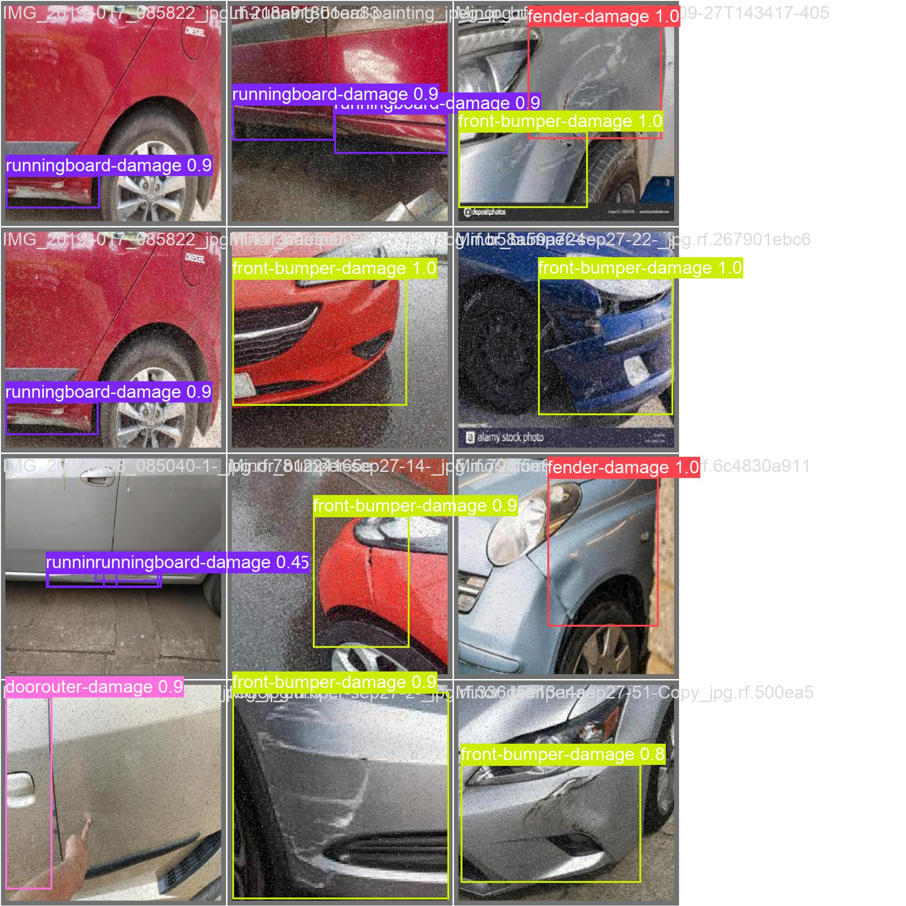
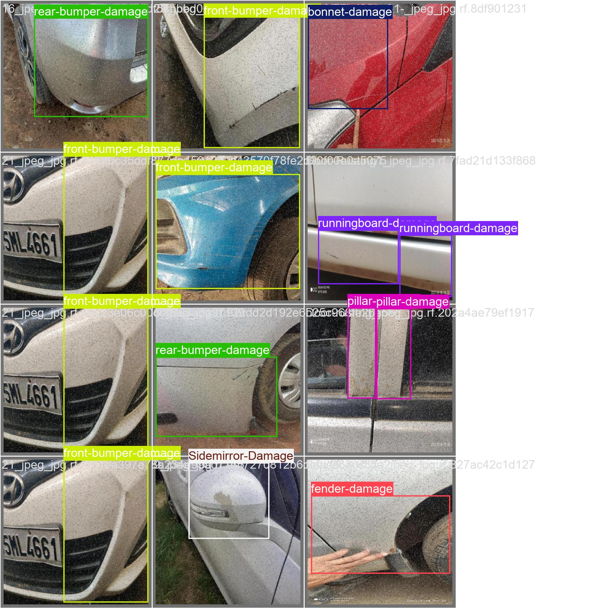
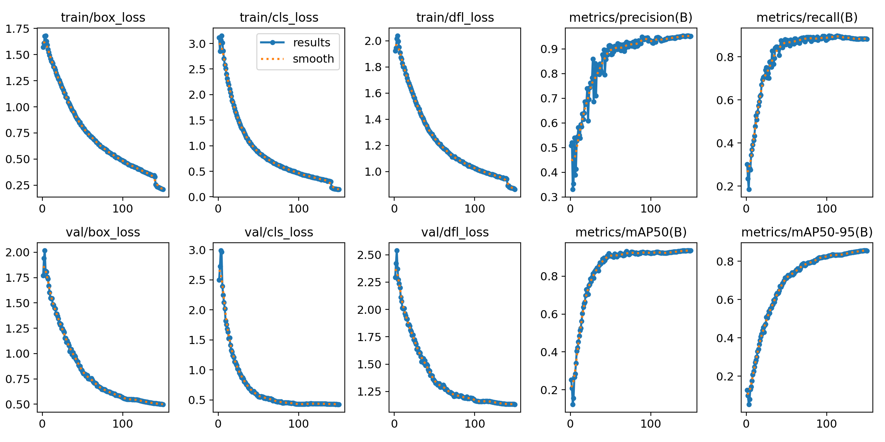

# 🚗 نظام تقدير تكاليف إصلاح السيارات الذكي (Ai-Car-Cost-Estimator)

**مشروع متكامل يدمج بين الرؤية الحاسوبية (Computer Vision) وتقنيات الويب الحديثة للكشف عن أضرار المركبات وتقدير تكاليف صيانتها آلياً.**

---

## 📸 عرض النتائج (Model Showcase)
النموذج يعتمد على **YOLOv11**، وتم تدريبه لتقديم أداء مستقر ودقة عالية في تحديد مختلف أنواع الصدمات.

| تحليل النتائج - مثال 1 (Inference) | تحليل النتائج - مثال 2 (Inference) |
| :---: | :---: |
|  |  |

| منحنيات التدريب ودقة النموذج (Training Results) |
| :---: |
|  |

---

## 🚀 رحلة تطوير وتحسين الموديل (Model Evolution)
لقد تم العمل على تحسين أداء النظام من خلال الانتقال من النسخة الأولية إلى النسخة الاحترافية لضمان دقة أعلى في الكشف.

### 📊 مقارنة الأداء (Nano vs Medium)

| المعيار (Metric) | النسخة النانو (Nano) | النسخة الميديم (Medium) 🌟 | التحسن |
| :--- | :---: | :---: | :---: |
| **الدقة العامة (mAP50)** | 91.6% | **93.5%** | +1.9% |
| **دقة التحديد (Precision)** | 93.2% | **95.2%** | +2.0% |
| **قوة الاستدعاء (Recall)** | 87.9% | **88.4%** | +0.5% |

### 💡 لماذا اخترنا النسخة الميديم (Why YOLOv11-Medium)؟
بناءً على النتائج المذكورة في الـ PDF والتحليل العملي، وفرت نسخة الـ **Medium** ميزات تفوقت بها على النسخة النانو:
1. **دقة متناهية:** قدرة أعلى على تمييز الفوارق البسيطة والدقيقة بين أنواع الصدمات المختلفة.
2. **ثبات النتائج:** تقليل التذبذب في التنبؤات (Predictions) عند معالجة صور ملتقطة في ظروف إضاءة أو زوايا صعبة.
3. **تحقيق التوازن:** وفرت التوازن المثالي المطلوب للمشروع بين سرعة المعالجة (Inference Time) ودقة النتائج النهائية اللازمة للتطبيق العملي.

---

## 🏗️ هيكلية المشروع (Project Architecture)

تم بناء المشروع بأسلوب احترافي يجمع بين قوة الذكاء الاصطناعي ومرونة تطبيقات الويب:

### 🔹 طبقة الذكاء الاصطناعي (AI Model Layer) - [📂 Model](./Model)
* تطوير الموديل باستخدام **YOLOv11-Medium** لتحقيق أفضل أداء تقني.
* معالجة الصور باستخدام مكتبة **OpenCV** لضمان دقة تحليل البيانات.

### 🔹 تطبيق الويب المتكامل (Full-Stack Web App) - [📂 Wep App](./Wep%20App)
يحتوي هذا المجلد على **الموقع بالكامل**:
* **Frontend:** واجهة عصرية وسلسة مبنية بـ **Next.js** و **Tailwind CSS**.
* **Backend:** نظام متكامل لمعالجة الصور وربط الموديل بواجهة المستخدم وتقديم تقديرات التكلفة.

---

## 📥 تحميل الأوزان (Downloads)
* **الموديل:** `car_damage_medium.pt`
* **رابط التحميل:** [صفحة الـ Releases](https://github.com/ElNaGGar7/Car-Damage-Detection-YOLOv11/releases)

---

## 📊 البيانات المستخدمة (Dataset)
تم الاعتماد على مجموعة بيانات أضرار السيارات من منصة Kaggle:
* **المصدر:** [Car Damage Detection Dataset](https://www.kaggle.com/datasets/anujms/car-damage-detection?resource=download)

---

## 👥 فريق العمل (Team Members)
* **Mostafa Ismail Quida** - `ID: 4241995`
* **Abdelrhman Hamdi Ahmed** - `ID: 4241454`

---

**© 2026 | Ai-Car-Cost-Estimator Project**
